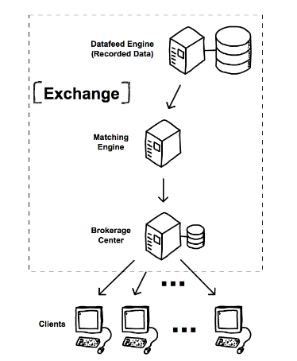

[header]: # "To generate a html version of this document:"
[pandoc]: # "pandoc README.md -c Templates/github.css -o README.html -s --self-contained"

# SHIFT Developer Guide

## System Diagram


## System Requirements

To run a full simulation day (6h30) of 30 stocks in the default settings, 22GB of extra space is required.

---

## Build Tools

These are required in order to install all tools and libraries contained in this guide. 

### Ubuntu:

- In the Terminal: `sudo apt-get install autoconf build-essential`

### macOS:

- In the Terminal: `xcode-select --install`

- Install [Homebrew](http://brew.sh/) (APT-like environment for macOS):
    - In the Terminal: `/usr/bin/ruby -e "$(curl -fsSL https://raw.githubusercontent.com/Homebrew/install/master/install)"`

---

## Installation Instructions

When installing in each of the platforms, use the following commands:

### Ubuntu:

- In the Terminal: `sudo apt-get install [pkg]`

### macOS:

- In the Terminal: `brew install [formula]`

Additional instructions for each platform may be included at the end of each section.

---

## Required Libraries

| Library               | Ubuntu [pkg]                | macOS [formula]     |
| --------------------- | --------------------------- | ------------------- |
| Boost (C++ libraries) | `libboost-all-dev`          | `boost`             |
| C++ REST SDK          | `libcpprest-dev`            | `cpprestsdk`        |
| cURL                  | `libcurl4-openssl-dev`      | *pre-installed*     |
| OpenSSL               | `libssl-dev`                | `openssl`           |
| libxml2               | `libxml2-dev`               | *pre-installed*     |
| PostgreSQL            | `postgresql-server-dev-all` | `postgresql` **\*** |
| UUID                  | `uuid-dev`                  | *pre-installed*     |

**\*** This macOS formula installs both PostgreSQL and its libraries.

---

## Required Tools

| Tool              | Ubuntu [pkg]                    | macOS [formula] |
| ----------------- | ------------------------------- | --------------- |
| CMake             | `cmake`                         | `cmake`         |
| Doxygen           | `doxygen`                       | `doxygen`       |
| Git               | `git`                           | `git`           |
| Pandoc            | `pandoc`                        | `pandoc`        |
| pkg-config        | `pkg-config`                    | `pkg-config`    |
| PostgreSQL **\*** | `postgresql postgresql-contrib` | `postgresql`    |

**\*** Required only in the machines where a PostgreSQL instance is needed.

---

## Recommended Tools

| Tool    | Ubuntu [pkg]    | macOS [formula] |
| ------- | --------------- | --------------- |
| Nmap    | `nmap`          | `nmap`          |
| cURL    | `curl`          | *pre-installed* |
| pgAdmin | `pgadmin3`      | *use a .dmg*    |
| unzip   | `unzip`         | *pre-installed* |

---

## Visual Studio Code

[VSCode](https://code.visualstudio.com/) is the recommended development environment, since it works the same in every operating system, and integrates well with CMake. 

Once downloaded, open Visual Studio Code, and install the following extensions:

| Extension                      |
| ------------------------------ |
| `C/C++`                        |
| `CMake`                        |
| `CMake Tools`                  |
| `Git History` **\***           |
| `vscode-todo-highlight` **\*** |
| `vscode-icons` **\***          |

**\*** Recommended, not required.

When done, run the `vscode_init.sh` shell script located in the `Scripts` folder. This will initialize VSCode configuration files in all projects (so that one does not have to create them by themselves).

---

## PostgreSQL Configuration

In order to access the database from an external computer (e.g. connecting to the server via pgAdmin), refer to this [question](https://dba.stackexchange.com/questions/83984/connect-to-postgresql-server-fatal-no-pg-hba-conf-entry-for-host/) in Stack Overflow.

SHIFT connects to PostgreSQL with a user called "hanlonpgsql4". Follow the steps below, and create this user in the last step.

### Ubuntu:

- In the Terminal:

``` bash
sudo service postgresql start
sudo -u postgres psql -d postgres
CREATE EXTENSION adminpack; /* complete postgresql-contrib installation */
CREATE ROLE "<user>" WITH NOSUPERUSER CREATEDB INHERIT LOGIN ENCRYPTED PASSWORD '<password>';
\q
```

### macOS:

- In the Terminal:

``` bash
brew services start postgresql
psql -d postgres
CREATE ROLE "<user>" WITH NOSUPERUSER CREATEDB INHERIT LOGIN ENCRYPTED PASSWORD '<password>';
\q
```

---

## PostgreSQL Database Instances Creation

These are the database instances that are required per project:

| Project         | Database Name         | Database Owner  | Creation Script    |
| --------------- | --------------------- | --------------- | ------------------ |
| DatafeedEngine  | HFSL_dbhft            | hanlonpgsql4    | `de_instances.sql` |
| BrokerageCenter | shift_brokeragecenter | hanlonpgsql4    | `bc_instances.sql` |

If you correctly created the "hanlonpgsql4" user in the previous step, use the scripts contained in the table above (located in the `Scripts` folder) with the following commands:

### Ubuntu:

- In the Terminal: `sudo -u postgres psql -d postgres -f <script_name>.sql`

### macOS:

- In the Terminal: `psql -d postgres -f <script_name>.sql`

---

## QuickFIX Installation

### Ubuntu & macOS:

- Choose a location to keep the QuickFIX source files (for debugging purposes), e.g. a "C++" folder in your home directory, and then **\***:

``` bash
git clone https://github.com/quickfix/quickfix.git
cd quickfix
git checkout tags/v1.15.1
mkdir build
cd build

# Ubuntu:
cmake -DCMAKE_CXX_FLAGS="${CMAKE_CXX_FLAGS} -Wno-deprecated" -DCMAKE_BUILD_TYPE=RelWithDebInfo -DHAVE_SSL=ON ..
# Raspbian:
cmake -DCMAKE_CXX_FLAGS="${CMAKE_CXX_FLAGS} -Wno-deprecated -DENABLE_BOOST_ATOMIC_COUNT" -DCMAKE_BUILD_TYPE=RelWithDebInfo -DHAVE_SSL=ON ..
# macOS:
cmake -DCMAKE_CXX_FLAGS="${CMAKE_CXX_FLAGS} -Wno-overloaded-virtual" -DCMAKE_BUILD_TYPE=RelWithDebInfo -DHAVE_SSL=ON -DOPENSSL_ROOT_DIR=/usr/local/opt/openssl ..

make
sudo make install
```

**\*** For server configurations that require more than 150 concurrent client connections, or when compiling on ARM, please use the custom QuickFIX version available in <https://github.com/hanlonlab/quickfix.git> (with no tags).

**\*** To use the experimental QuickFIX-PostgreSQL integration code, please add the option `-DHAVE_POSTGRESQL=ON` when building QuickFIX.

- Further Documentation: <http://www.quickfixengine.org/quickfix/doc/html/> 

---

## SHIFT Installation

**Before installing any of the SHIFT servers, you should create proper configuration files.**

The default configuration files (pointing to localhost) can be copied by using the `copy_config.sh` script contained in the `Scripts` folder or by using the `-f` parameter in the installer. 

To install all servers and libraries:

- In the Terminal: `sudo ./install.sh`

To uninstall all servers and libraries:

- In the Terminal: `sudo ./install.sh -u`

For additional options:

- In the Terminal: `./install.sh -h`

When installing separate modules, required SHIFT libraries will be automatically installed.

A list of the aliases used by the installer is provided below.

| Alias | Project Name    | Project Type    | Binary/Library Name          | Prereqs |
| ----- | --------------- | --------------- | ---------------------------- | ------- |
| LM    | LibMiscUtils    | Shared Library  | `libshift_miscutils` **\***  | *none*  |
| DE    | DatafeedEngine  | Server (Binary) | `DatafeedEngine`             | LM      |
| ME    | MatchingEngine  | Server (Binary) | `MatchingEngine`             | LM      |
| BC    | BrokerageCenter | Server (Binary) | `BrokerageCenter`            | LM      |
| LC    | LibCoreClient   | Shared Library  | `libshift_coreclient` **\*** | LM      |

By default, everything is installed under `/usr/local/`, but the `-p` parameter can be used to change the default installation path prefix.

Given an installation path prefix, the following directories are used:

| Type                 | Path                                   |
| -------------------- | -------------------------------------- |
| Binaries             | ${PREFIX}/bin/                         |
| Configuration Files  | ${PREFIX}/share/shift/*binaryname*/    |
| Libraries            | ${PREFIX}/lib/                         |
| Library Header Files | ${PREFIX}/include/shift/*libraryname*/ |

**\*** Library files with enabled debug symbols are also provided with the `-d` postfix.

---

## Adding Users to the System

A `user_entries.sh` script contained in the `Scripts` folder is provided to create the required clients for the system to work.

To add more users to the system:

- In the Terminal: `BrokerageCenter -u [username] -p [password] -i [firstName] [lastName] [email]`

These can only connect to the platform using the WebClient, and can also be added via the WebClient interface.

If one wants to connect directly to the BrokerageCenter (e.g. with the PythonClient), the `-s` parameter is also required:

- In the Terminal: `BrokerageCenter -u [username] -p [password] -i [firstName] [lastName] [email] -s`

---

## Starting and Stopping all Services

To start up all services:

- In the Terminal: `./startup.sh`

To terminate all services:

- In the Terminal: `./startup.sh -k`

For additional options:

- In the Terminal: `./startup.sh -h`

---

## Fixing the Shared Library Cache (Ubuntu 18.04 LTS Bionic Beaver)

When running our servers for the first time in Ubuntu, it is possible the system will not find our shared libraries. To fix such problem:

- In the Terminal: `sudo ldconfig`

---

## Using LibMiscUtils FileCryptor

Configuration files are encrypted. To update config files, updating the format and configuration values will require utilizing the FileCryptor tool, included in LibMiscUtils.

To build:

```
cd LibMiscUtils;
mkdir build;
cd build;
cmake .. -DADDONS=on
``` 

Afterwards, the FileCryptor tool should be available in LibMiscUtils/build/Debug

To encrypt:

- `FileCryptor -e TARGETFILE -o OUTPUTFILE`

To decrypt
- `FileCryptor -d TARGETFILE -o OUTPUTFILE`

---

## Configuration Format
Below are examples of how the three main module configuration files look like:
- DatafeedEngine:
```
DBName=shift_datafeedengine
DBHost=127.0.0.1
DBUser=hanlonpgsql4
DBPassword=
DBPort=
```

- MatchingEngine:
```
DBUser=hanlonpgsql4
DBPassword=
DBHost=127.0.0.1
DBPort=
```

- BrokerageCenter:
```
DBName=shift_brokeragecenter
DBUser=hanlonpgsql4
DBPassword=
DBHost=127.0.0.1
DBPort=
```
